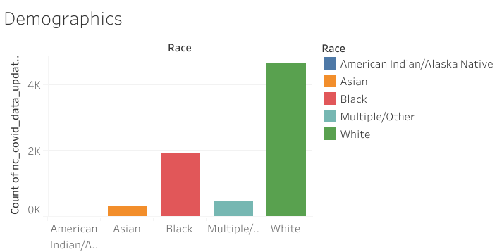
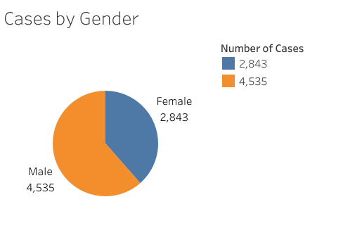

# Covid Warriors
## Project Outline
### Project Topic
We have decided to take a look at COVID-19 data in hopes of determining some correlation with demographic and geographic factors. The dataset we will be working with is a running tally of COVID infections available on the CDC website. 

### Pre-processing
After deciding on a dataset from the CDC, we were able to do some data cleaning in Pandas:
* Filtered the dataset to show North Carolina cases only
* Remove and rows that contained null or unknown values
* Dropped columns with unnecessary data for our project

Once cleaned, we exported the DataFrame to a csv file to get ready for some exploritory analysis. 

### Exploritory Analysis
We plan to use matplotlib to begin visualizing how we might begin to use the dataset to answer possible questions:
* How do demographic factors impact the sevarity of COVID illness?
* Can we predict the rate of hospitalizations and deaths using machine learning based on those facotrs?

Furthermore, once we have a good understanding of the questions machine learning can help us with, we'll use Tableau to put together a visualization dashboard with our results.

### Preliminary Results
By mapping the data in Tableau, we were able to get a good look at what questions we can help answer with machine learning. By determining which demographic factors contribute to covid hospitalization, we can then direct resources to the communities that would be most effected by an increase in cases.

