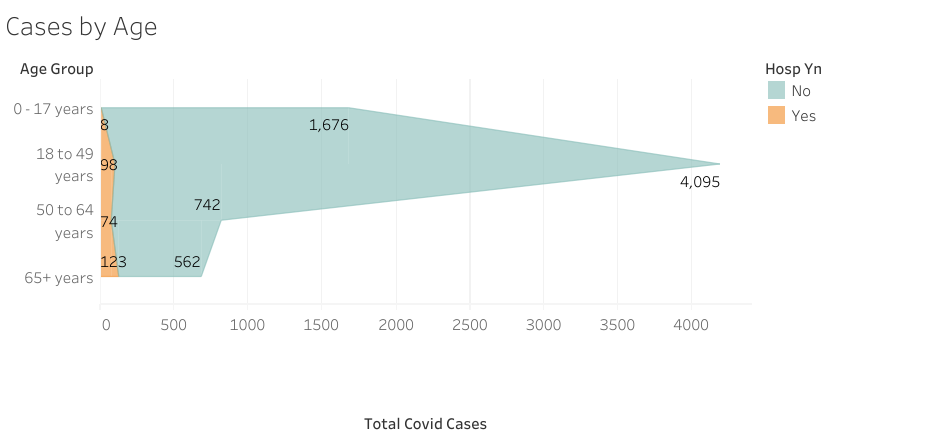

# Covid Warriors

## Overview of our Analysis
Coronavirus disease 2019 (COVID-19), caused by severe acute respiratory syndrome coronavirus 2, was first identified in Wuhan, China, in December 2019. As the number of COVID-19 infections and deaths worldwide continues to increase rapidly, the prevention and control of COVID-19 remains urgent. This article aims to analyze COVID-19 from a geographical perspective, and this information can provide useful insights for rapid visualization of spatial-temporal epidemic information and identification of the factors important to the spread of COVID-19. This project is focused on analyzing North Calorina state demographics by total number of cases and hospitalizations.

## Technologies
- Python 
- Jupyter notebook 
- Pandas 
- SQL 
- Tableau
- AWS (Amazon Web Service)
- Machine Learning

## Data Sources
- [CDC](https://data.cdc.gov/Case-Surveillance/United-States-COVID-19-Cases-and-Deaths-by-State-o/9mfq-cb36) 
- [North Calorina state csv file](https://github.com/JohnCselcuk/Covid-Warriors/tree/main/Data_source)
- [NC State Covid Road map](https://covid19.ncdhhs.gov/)
- [Feredal Government](https://www.usa.gov/coronavirus)

## Results
### Data Cleaning
To begin our project, we uploaded the csv file into Jupyter Notebook and created a DataFrame with Pandas. From there, we were able to parse through the data to filter out null values and any irrelevant columns to our project, and export the cleaned DataFrame to a new csv file. With the cleaned data in hand, we were able to load the csv into an AWS database for remote access for the whole team. 

Using Tableau, we were able to make some conclusions based on the data for COVID hospitalizations in North Carolina:

### Machine Learning
Our main focus using machine learning was to determine which, if any, patient demographic factors related to hospitalization. Using several machine learning modules, it became clear that COVID hospitalizations are difficult to predict. Using scaled data in the RandomForest module from sklearn produced the best results, with only 30% accuracy of predicting hospitalizations.

Furthermore, it appears that a patients age group is the most important feature when it comes to predicting hospitalization. Older adults are more likely to get very sick from COVID-19. Getting very sick means that older adults with COVID-19 might need hospitalization, intensive care, or a ventilator to help them breathe, or they might even die. The risk increases for people in their 50s and increases in 60s, 70s, and 80s. People 85 and older are the most likely to get very sick.

